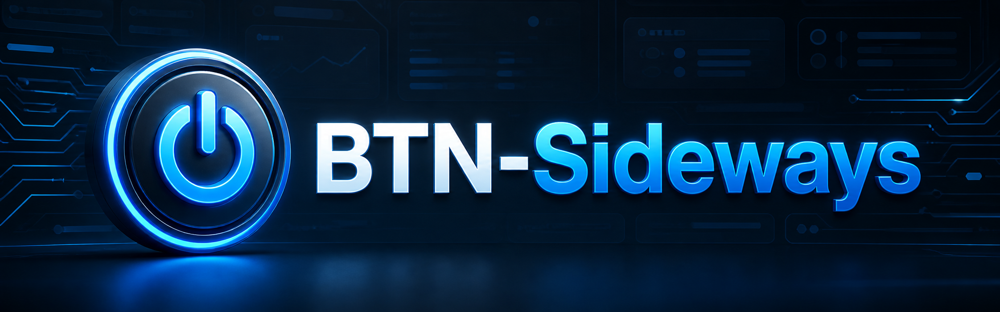

<p align="center">
  
</p>

<h1 align="center">BTN Sideways</h1>

<p align="center"><em>A widescreen dark theme paired with an all-in-one companion userscript.</em></p>

<p align="center">
  
  
  
  
  
</p>

---

## Overview

BTN Sideways is a paired stylesheet and userscript bundle. The CSS handles the
site-wide visual restyle; the userscript adds the interactive pieces and the
external metadata panels.

Install both together for the intended result:

| File | Role |
|---|---|
| `BroadcastThatNet.css` | Site-wide dark widescreen restyle |
| `BTN All-In-One.user.js` | Eleven helper modules merged into one install |

The userscript runs on its own, but its layout assumes the CSS is present — and the
CSS is designed around the panels the userscript creates.

## Features

The userscript merges eleven helpers into one install. Each module runs only on the
pages it needs, and a failing module is caught so the rest still load.

- Animated logo across all pages.
- Front-page tidy-up with unread and collapse handling.
- TMDb trending shows on the front page.
- Show/hide toggle for the search results table.
- Series-page declutter with a rebuilt info panel and configurable table defaults.
- One-line detail rows for easier scanning.
- Fanart.tv ClearLogo support.
- TMDb recommended shows.
- IMDb Parents Guide panel with a collapsed card layout.
- Sonarr integration with multi-server support.
- TMDb enricher: hero banner, metadata pills, actor cards, seasons, reviews,
  recommendations, trailer link, keywords and embed fixes.
- A settings tab on your profile edit page with per-feature toggles.

The stylesheet supplies the dark widescreen look, dashboard spacing, cleaner tables,
refreshed icons, improved series layout, lightbox fixes and the panel styling.

## Install

### 1. Stylesheet

Add the hosted URL to your profile's stylesheet setting:

```text
https://Im-That-Guy-16.github.io/BTN-Sideways/BroadcastThatNet.css
```

Alternatively, load `BroadcastThatNet.css` in a userstyle manager such as
[Stylus](https://add0n.com/stylus.html).

### 2. Userscript

Install `BTN All-In-One.user.js` with [Tampermonkey](https://www.tampermonkey.net/)
or [Violentmonkey](https://violentmonkey.github.io/):

```text
https://Im-That-Guy-16.github.io/BTN-Sideways/BTN%20All-In-One.user.js
```

> Disable any older individual scripts that duplicate these features, or you will
> get double panels and conflicting layout changes.

### 3. TMDb API key

No key ships with the script. Add your own from the userscript manager menu:
open a page where the script is active → manager icon → **Set TMDB API key (v3)**
→ paste → reload. A v4 bearer token works too and takes precedence if both are set.

TMDb powers the trending, recommended and enricher modules; they skip themselves
without a key.

### 4. Optional settings

| Setting | Where |
|---|---|
| Default table state (collapsed / open / latest only) | Manager menu → the table default entry |
| Sonarr servers | Series page → `[Sonarr]` action link |
| Per-feature toggles | Profile edit page → **Userscript** tab |

## Tweaking

For deeper changes the userscript is split into numbered modules. The two most
useful entry points are `CONFIG` in *Series Page Declutter* and `SHOW` in
*TMDB Enricher*. Edit, save, reload.

## Notes

Userscript storage is per-script, so moving from separate scripts to this merged one
means re-entering your TMDb and Sonarr settings once. Browser `localStorage` values
such as read state are untouched.

## Credits

Original work by Prism16 and the theme and userscript authors this bundle was merged
from.

## Licence

Released under the [MIT Licence](LICENSE).
